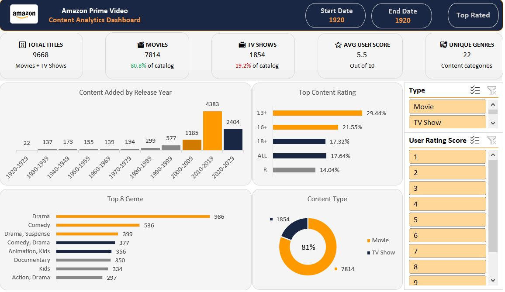

# 📊 Amazon Prime Video Content Analytics Dashboard

> An end-to-end Excel analytics project exploring Amazon Prime Video's content catalog — from raw data to an interactive business intelligence dashboard.

---

## 🧭 Table of Contents

- [Overview](#overview)
- [About This Project](#about-this-project)
- [Objectives](#objectives)
- [Dataset Description](#dataset-description)
- [Workbook Structure](#workbook-structure)
- [Dashboard Features](#dashboard-features)
- [Tools & Excel Skills Used](#tools--excel-skills-used)
- [Key Insights](#key-insights)
- [Project Workflow](#project-workflow)
- [Repository Structure](#repository-structure)
- [Results & Business Impact](#results--business-impact)
- [Screenshots](#screenshots)
- [Future Improvements](#future-improvements)
- [Skills Demonstrated](#skills-demonstrated)
- [Conclusion](#conclusion)
- [Tags](#tags)

---

## Overview

This project performs a comprehensive analysis of the **Amazon Prime Video content catalog** using Microsoft Excel as the primary analytics tool. It covers the full data analytics lifecycle — from raw data ingestion and cleaning, through KPI calculation and pivot table aggregation, to the delivery of a polished, interactive Excel dashboard.

The analysis surfaces actionable insights around content distribution, genre trends, audience rating categories, release year patterns, and user engagement scores — providing a data-driven view of how Amazon's streaming library is composed and how it has evolved over time.

---

## About This Project

| Attribute | Detail |
|-----------|--------|
| **Project Type** | Data Analytics & Dashboard Development |
| **Tool** | Microsoft Excel |
| **Domain** | Media & Entertainment / Streaming Analytics |
| **Dataset Size** | 9,668 titles |
| **Timeframe** | Content spanning 1920 – 2021 |
| **Deliverable** | Interactive Excel Dashboard |

> **For Recruiters:** This project demonstrates end-to-end analytics capability entirely within Excel — including data wrangling, formula-driven KPIs, pivot table design, and dashboard storytelling. It reflects the type of practical, business-ready analysis used in product, content strategy, and BI roles.

---

## Objectives

- Analyze the overall distribution of Amazon Prime Video's content catalog
- Compare **Movies vs. TV Shows** across count, genre, and rating dimensions
- Identify the **top genres** and most common **content rating categories**
- Examine **release year trends** to understand catalog growth over decades
- Build an **interactive Excel dashboard** enabling dynamic filtering and visual exploration
- Demonstrate proficiency in **Excel analytics, data cleaning, and business dashboarding**

---

## Dataset Description

The raw dataset contains metadata for **9,668 Amazon Prime Video titles**, including both movies and TV shows. Each record includes attributes such as title, type, director, cast, country of origin, release year, content rating, duration, genre classification, and a user rating score.

### Raw Data Columns

| Column | Description |
|--------|-------------|
| `show_id` | Unique identifier for each title |
| `type` | Content type: Movie or TV Show |
| `title` | Title name |
| `director` | Director(s) of the content |
| `cast` | Featured cast members |
| `country` | Country of origin |
| `date_added` | Date added to Prime Video |
| `release_year` | Original year of release |
| `rating` | Content rating (e.g., 13+, R, PG-13) |
| `duration` | Runtime in minutes or number of seasons |
| `listed_in` | Genre classification |
| `Rating` | Numerical user rating score (1–10) |
| `description` | Short synopsis of the title |

---

## Workbook Structure

The Excel workbook is organized into **six purposeful sheets**, each serving a distinct role in the analytics workflow:

| Sheet | Role |
|-------|------|
| `Amazon_prime_title` | Raw source dataset — unmodified original data |
| `Cleaned Data` | Transformed dataset with standardized columns, corrected data types, and structured genre/rating fields |
| `PT_KPIs` | Pivot tables aggregating content ratings, genre counts, content type distribution, and release year trends |
| `Calculations` | Cell-formula-driven KPI computations: total titles, movie count, TV show count, average user score, and unique genre count |
| `Dashboard` | Final interactive dashboard with charts, KPI cards, and slicers for dynamic filtering |
| `Summary` | Narrative summary of key findings and data quality metrics |

---

## Dashboard Features

The interactive dashboard consolidates all analysis into a single, visually cohesive view designed for business stakeholders.

### 📌 KPI Cards

| KPI | Value |
|-----|-------|
| Total Titles | **9,668** |
| Total Movies | **7,814** |
| Total TV Shows | **1,854** |
| Average User Score | **5.5 / 10** |
| Unique Genres | **22** |

### 📈 Visualizations

- **Content Added by Release Year** — Decade-by-decade bar chart showing catalog growth from the 1920s through 2021
- **Top Content Ratings** — Bar chart of the most prevalent audience rating categories (13+, 16+, ALL, 18+, R)
- **Top Genres** — Ranked visualization of genre frequency, led by Drama, Comedy, and Documentary
- **Content Type Breakdown** — Donut chart comparing the Movies vs. TV Shows split (~81% / ~19%)

### 🎛️ Interactive Filters (Slicers)

The dashboard supports dynamic filtering by:
- **Content Type** (Movie / TV Show)
- **User Rating Score** (numerical score range)

All charts and KPI cards respond dynamically when slicers are applied, enabling audience-specific and category-specific deep dives.

---

## Tools & Excel Skills Used

| Category | Skills Applied |
|----------|---------------|
| **Data Processing** | Data Cleaning, Column Standardization, Data Type Correction |
| **Formulas** | COUNTIF, AVERAGEIF, COUNTA, IF, TEXT functions |
| **Aggregation** | Pivot Tables, Grouped Aggregations, Grand Totals |
| **Visualization** | Pivot Charts, Bar Charts, Donut Charts, KPI Cards |
| **Interactivity** | Slicers, Dynamic Filtering, Connected Chart Controls |
| **Design** | Dashboard Layout, Color Theming, Emoji-enhanced Labels |
| **Documentation** | Summary Sheet, Inline Cell Comments, Structured Workbook Design |

---

## Key Insights

The following insights were derived from the dashboard and supporting pivot analyses:

**1. Movies Dominate the Catalog**
Movies account for approximately **80.8%** of all titles (7,814 out of 9,668), with TV Shows making up the remaining **19.2%** (1,854 titles). This signals Prime Video's historically movie-heavy catalog strategy.

**2. Drama is the Leading Genre**
With **986 titles** in the Drama category alone — and additional Drama-hybrid genres (Drama/Suspense: 399, Comedy/Drama: 377) — Drama is the cornerstone of the platform's content identity.

**3. Catalog Growth Peaked in the 2010s**
The 2010–2019 decade accounts for the largest share of titles at **4,383 entries (45.3%)**, followed by 2020–2029 at 2,404, reflecting aggressive content acquisition during the streaming boom.

**4. 13+ Is the Most Common Rating**
The **13+ rating** leads all content categories with **2,117 titles**, indicating that Prime Video targets a broad teen-and-above demographic as its primary audience segment.

**5. Diverse but Niche Genre Landscape**
While Drama and Comedy lead, the platform maintains **22+ unique genre combinations**, showing breadth of content diversity designed to serve varied viewer tastes.

**6. Average User Score Indicates Moderate Reception**
The average user rating of **5.5 out of 10** suggests that while the catalog is expansive, quality perception is mixed — pointing to opportunities for curation and quality-weighted content strategies.

---

## Project Workflow

```
1. Data Collection
   └── Sourced Amazon Prime Video dataset with 9,668 content records

2. Data Cleaning
   └── Standardized column names, corrected data types, handled missing values,
       separated duration into minutes (movies) and seasons (TV shows)

3. Data Transformation
   └── Created structured genre, rating, and release year fields
       for pivot-ready aggregation

4. KPI Calculations
   └── Built formula-driven KPI cells: total titles, movie/show counts,
       average user score, unique genre count

5. Pivot Table Creation
   └── Built pivot tables for content ratings, genre distribution,
       content type split, and release year decade grouping

6. Dashboard Development
   └── Designed interactive dashboard with KPI cards, pivot charts,
       donut chart, and connected slicers

7. Insight Generation
   └── Documented key findings in Summary sheet and README
```

---

## Repository Structure

```
amazon-prime-excel-dashboard/
│
├── Amazon_Prime_Dashboard.xlsx       # Main Excel workbook (all sheets)
│
├── README.md                         # Project documentation (this file)
│
├── assets/
    └── dashboard_screenshot.png      # Dashboard preview image
```

---

## Results & Business Impact

This dashboard equips content strategy and product stakeholders with the ability to:

- **Monitor catalog composition** — Understand the balance of Movies vs. TV Shows and make acquisition decisions accordingly
- **Track genre performance** — Identify which genres dominate and where gaps exist for new content investment
- **Understand audience targeting** — Use content rating distribution to align catalog strategy with demographic goals
- **Analyze historical trends** — Evaluate decade-by-decade release patterns to contextualize catalog maturity
- **Enable self-service analysis** — Interactive slicers allow non-technical stakeholders to explore data without requiring ad-hoc requests

---

## Screenshots

> 📸 Dashboard Preview



*The interactive dashboard displays KPI cards, genre analysis, rating distribution, content type breakdown, and release year trends — all dynamically filterable via slicers.*

---

## Future Improvements

| Enhancement | Description |
|-------------|-------------|
| **Power Query Integration** | Automate data cleaning and transformation with a refreshable pipeline |
| **Power BI Version** | Rebuild the dashboard in Power BI for web publishing and richer interactivity |
| **Automated Data Refresh** | Connect to live or periodically updated data sources |
| **Genre Forecasting** | Apply trend analysis to project genre demand over time |
| **User Engagement Analysis** | Incorporate watch-time or engagement metrics for deeper behavioral insights |
| **Country-Level Breakdown** | Add geographic dimension to understand regional content strategies |
| **NLP-Based Genre Tagging** | Use text analysis on descriptions to improve genre classification accuracy |

---

## Skills Demonstrated

```
✅ Microsoft Excel (Advanced)       ✅ Data Cleaning & Transformation
✅ Pivot Tables & Pivot Charts      ✅ KPI Design & Formula Development
✅ Interactive Dashboard Design     ✅ Slicer-Based Dynamic Filtering
✅ Data Visualization               ✅ Business Insight Storytelling
✅ Structured Workbook Architecture ✅ Analytical Documentation
```

---

## Conclusion

This project demonstrates a complete, end-to-end analytics workflow executed entirely within Microsoft Excel — from raw, unstructured data to a polished, interactive business dashboard. By combining data cleaning discipline, formula-driven KPI design, pivot table aggregation, and purposeful visual layout, the dashboard translates 9,668 rows of content metadata into clear, actionable insights about Amazon Prime Video's catalog.

The result is a recruiter-ready portfolio piece that reflects the practical Excel analytics skills used daily in data analyst, business analyst, and BI roles across media, product, and strategy functions.

---

<div align="center">

**Built with 💙 using Microsoft Excel**

*If you found this project useful, consider giving it a ⭐ on GitHub!*

</div>
